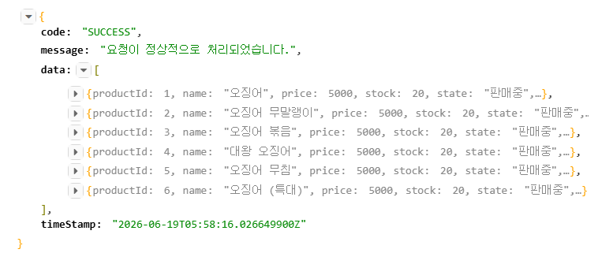
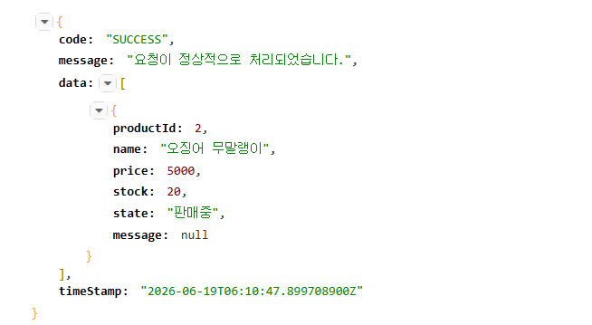
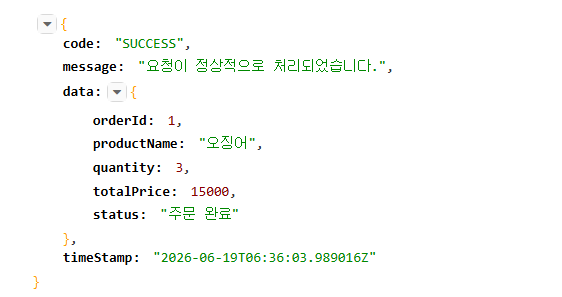
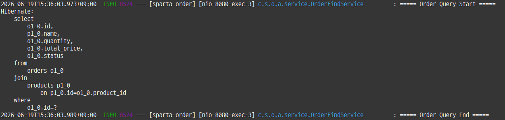

# Sparta-Order Warming-Up Project

## 1. 구현 진행 상황 체크

- 프로젝트 세팅 (DB 연결 포함) - 완료 (2026/06/16)
- 상품 CRUD 동작 확인 - 완료 (2026/06/16)
- 주문 생성 동작 확인 - 완료 (2026/06/16)
- 주문 조회 동작 확인 - 완료 (2026/06/19)
- 상품 목록 조회 확인 - 완료 (2026/06/19)
- 주문, 상품 페이지네이션 - 미완료
- 주문 목록 조회 시 N+1 - 완료 (2026/06/19)
- 상품 재고 원자적 차감 구현 - 완료 (2026/06/16)

## 2. 동작 여부
`Product Domain API`

- Talend API Tester 사용


### Product API
1. 상품 등록
```
POST /api/product/c
body {
  name : "오징어",
  price : 5000,
  stock : 20
}
```


2. 상품 이름 수정
```
PATCH /api/product/c/{productId}/name
body {
  name : "오징어 무말랭이"
}
```


3. 상품 금액 수정
```
PATCH /api/product/c/{productId}/price
body {
  price : 7500
}
```


4. 상품 재고 수정
```
PATCH /api/product/c/{productId}/stock
body {
  stock : 50
}
```


5. 상품 판매 중지
```
PATCH /api/product/c/{productId}/discountinue
```


6. 상품 판매 개시
```
PATCH /api/product/c/{productId}/selling
```


7. 상품 삭제
```
DELETE /api/product/c/{productId}
```


8. 상품 여러개 조회 - 삭제된 상품은 제외
```
GET /api/product/r?name=오징어
```


9. 상품 1개 조회
```
GET /api/product/r/{productId}
```


### Order API
1. 주문 생성
```
POST /api/order/c
body {
  productId : 1,
  quantity : 3
}
```


2. 주문 조회 1건
```
GET /api/order/r/{orderId}
```


JPA 쿼리
