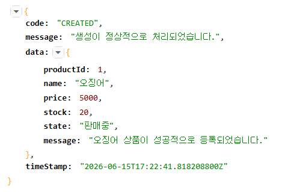
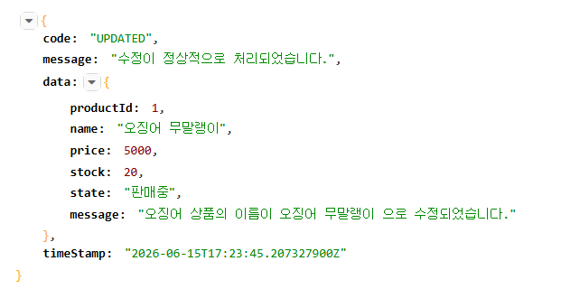
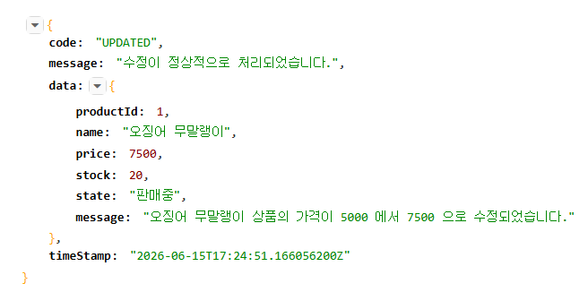
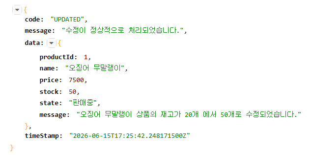
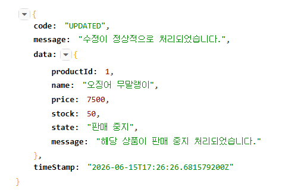
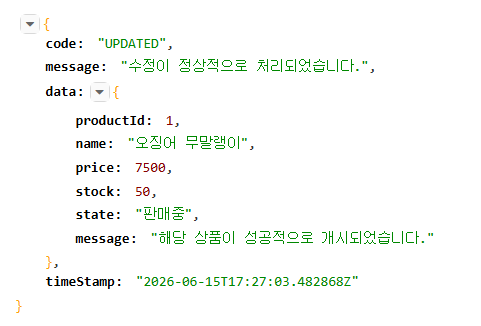
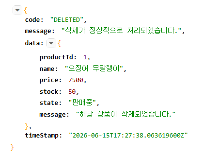
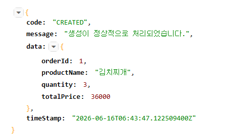

# Sparta-Order Warming-Up Project

## 1. 구현 진행 상황 체크

- 프로젝트 세팅 (DB 연결 포함) - 완료 (2026/06/16)
- 상품 CRUD 동작 확인 - 완료 (2026/06/16)

## 2. 동작 여부
`Product Domain API`

- Talend API Tester 사용

### Product API
1. 상품 등록

2. 상품 이름 수정

3. 상품 금액 수정

4. 상품 재고 수정

5. 상품 판매 중지

6. 상품 판매 개시

7. 상품 삭제

### Order API
1. 주문 생성

